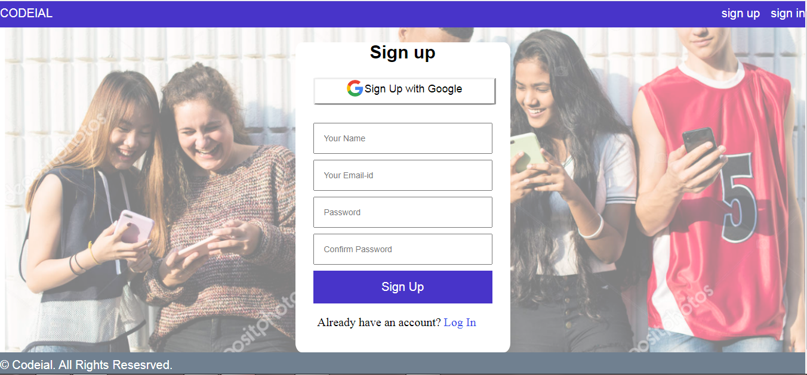
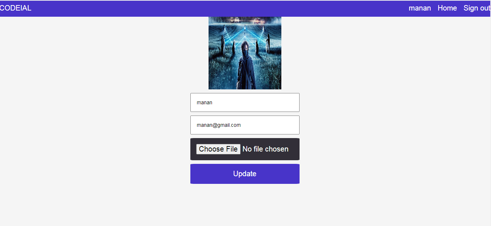

# Codeial-A Social media website

## Description
This website gives users the opportunity to connect their thoughts on the projects they are working on. This website includes features such as creating and updating profile, posting text ,liking and commenting on posts, viewing colleagues profiles and texting colleagues. The user can post their insights about the update .On successfully posting,
the website sends a mail to the user's email and a notification pops up to notify him.

## Screenshots

## Technologies Stack:

### Components
* HTML,CSS,Javascript,jQuery,Ajax,Sass
* Node.js,MongoDB,Express.js

### Insights

* passport-jwt strategy for authentication and authorization.
* passport-google-oauth2 strategy for social authentication through  google.
* used Nodemailer to send out emails.
* used socket.io for implementing chat engine.

## For Security purpose
* for security issues , the verification through the googleOauth config file have been intentionally encrypted and file have been ignored while uploading
google_client_id: env_dev.google_client_id || process.env.CODEIAL_GOOGLE_CLIENT_ID,
    google_client_secret: env_dev.google_client_secret || process.env.CODEIAL_GOOGLE_CLIENT_SECRET,
    google_call_back_url: env_dev.google_call_back_url || process.env.CODEIAL_GOOGLE_CALLBACK_URL,
    
 * just replace this variables by creating the google oauth2 links and the project is good to go.

## How to Install

* Clone the project onto your local machine.
* Then cd codeial
* npm install
* npm start
* Visit your app at http://localhost:8000.

